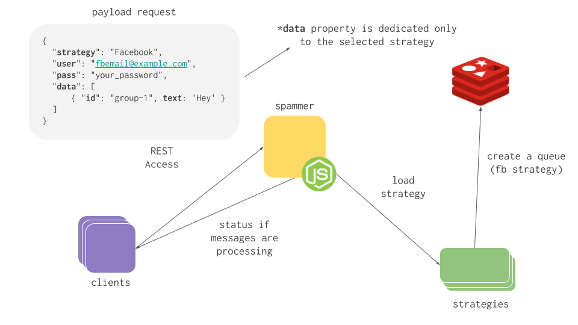

<p align="center">
  
  <h3 align="center">Spammer</h3>
  <p align="center">Strategy-oriented social network spammer.</p>

  <p align="center">
    <a href="http://standardjs.com/">
      
    </a>
  </p>
</p>

---

The easiest way to spam social networks. Just create a strategy or use one of the existing ones.

### Usage



> **You can use the [Spammer Runner](https://github.com/blackcapz/spammer-runner) project(basically is an docker environment) to use the [UI](https://github.com/blackcapz/spammer-ui) and [Core](https://github.com/blackcapz/spammer-core) instead of using REST access.**

Basically is a **`POST`** method to **`/spam`** 

### Strategies payload

_facebook_
```json
{
  ... 
  "data": [
    { "id": "group-1", "text": "Hello World" }
  ]
  ...
}
```
