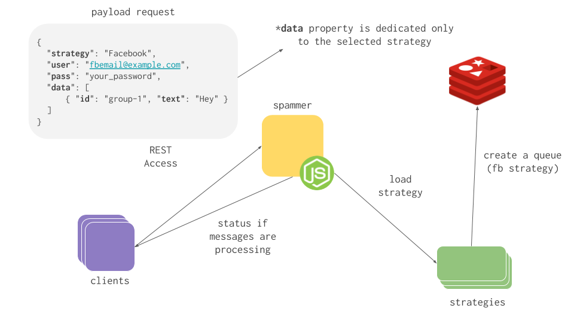

<p align="center">
  
  <h3 align="center">Spammer</h3>
  <p align="center">Strategy-oriented social network spammer.</p>

  <p align="center">
    <a href="http://standardjs.com/">
      
    </a>
  </p>
</p>

---

Welcome to the easiest way to spam social networks. <br>
It's a simple REST api to spam yours social networks.

### Getting start
- Install dependencies: `npm install`
- Run the server: `npm run start`

### Usage



> **You can use the [Spammer Runner](https://github.com/blackcapz/spammer-runner) project(basically is an docker environment) to use the [UI](https://github.com/blackcapz/spammer-ui) and [Core](https://github.com/blackcapz/spammer-core) instead of using REST access.**

Basically is a **`POST`** method to **`/spam`** 

### Sending a request

_facebook_

[POST] URL:`http://localhost:3000/spam`

[Body]:
```json
{
	"strategy":"Facebook",
	"user": "<YOUR_EMAIL>",
	"pass": "<YOUR_PASSWORD>",
	"data": [
		{ "id": "<group_id>",
		  "text": "<Message>",
		  "type": "GROUP or FEED"
		}]
}
```
